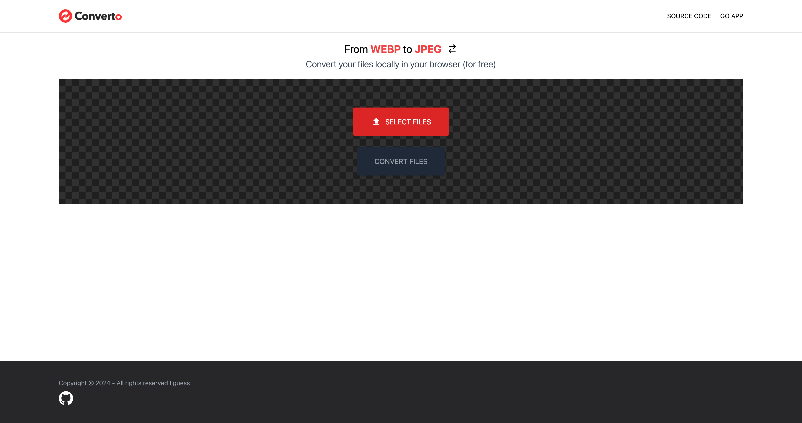

# WEBP_CONVERTER_WEB_APP

Web application to convert your webp files to jpeg and vice versa locally into your browser.

> No Api involved | Maintain your confidentiality.



## Start the project

#### Requirements

-   node
-   pnpm / npm

#### Run it

```bash
cd app/ && pnpm install
pnpm dev
```

The app should be available at http://localhost:5173/.


